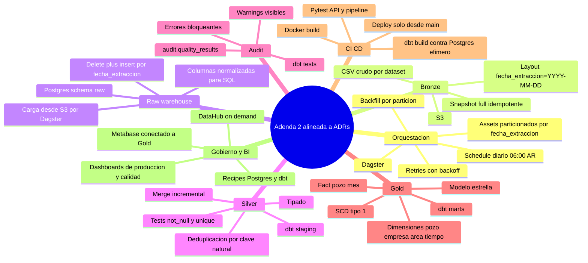

# Mindmap de implementacion segun ADRs

```mermaid
mindmap
  root((Adenda 2 alineada a ADRs))
    Orquestacion
      Dagster
      Assets particionados por fecha_extraccion
      Schedule diario 06:00 AR
      Backfill por particion
      Retries con backoff
    Bronze
      S3
      CSV crudo por dataset
      Layout fecha_extraccion=YYYY-MM-DD
      Snapshot full idempotente
    Raw warehouse
      Postgres schema raw
      Carga desde S3 por Dagster
      Delete plus insert por fecha_extraccion
      Columnas normalizadas para SQL
    Silver
      dbt staging
      Tipado
      Deduplicacion por clave natural
      Merge incremental
      Tests not_null y unique
    Audit
      dbt tests
      audit.quality_results
      Errores bloqueantes
      Warnings visibles
    Gold
      dbt marts
      Modelo estrella
      SCD tipo 1
      Fact pozo mes
      Dimensiones pozo empresa area tiempo
    CI CD
      Pytest API y pipeline
      dbt build contra Postgres efimero
      Docker build
      Deploy solo desde main
    Gobierno y BI
      DataHub on demand
      Recipes Postgres y dbt
      Metabase conectado a Gold
      Dashboards de produccion y calidad
```
