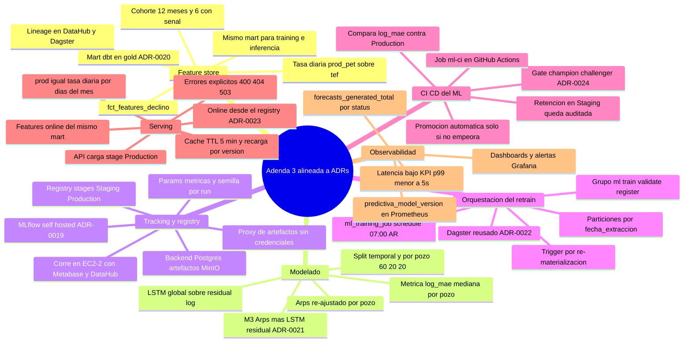

# Mindmap de implementacion segun ADRs (Fase 3)

```mermaid
mindmap
  root((Adenda 3 alineada a ADRs))
    Feature store
      Mart dbt en gold ADR-0020
      fct_features_declino
      Tasa diaria prod_pet sobre tef
      Cohorte 12 meses y 6 con senal
      Mismo mart para training e inferencia
      Lineage en DataHub y Dagster
    Modelado
      M3 Arps mas LSTM residual ADR-0021
      Arps re-ajustado por pozo
      LSTM global sobre residual log
      Metrica log_mae mediana por pozo
      Split temporal y por pozo 60 20 20
    Tracking y registry
      MLflow self hosted ADR-0019
      Backend Postgres artefactos MinIO
      Corre en EC2-2 con Metabase y DataHub
      Params metricas y semilla por run
      Registry stages Staging Production
      Proxy de artefactos sin credenciales
    Orquestacion del retrain
      Dagster reusado ADR-0022
      Grupo ml train validate register
      ml_training_job schedule 07:00 AR
      Particiones por fecha_extraccion
      Trigger por re-materializacion
    CI CD del ML
      Gate champion challenger ADR-0024
      Compara log_mae contra Production
      Promocion automatica solo si no empeora
      Job ml-ci en GitHub Actions
      Retencion en Staging queda auditada
    Serving
      Online desde el registry ADR-0023
      API carga stage Production
      Cache TTL 5 min y recarga por version
      Features online del mismo mart
      prod igual tasa diaria por dias del mes
      Errores explicitos 400 404 503
    Observabilidad
      forecasts_generated_total por status
      predictiva_model_version en Prometheus
      Latencia bajo KPI p99 menor a 5s
      Dashboards y alertas Grafana
```
