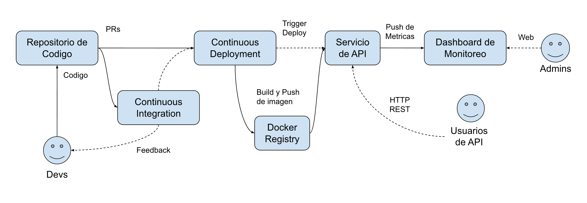

# Agenda Técnica Fase 1: Demo del Servicio

* [Agenda Técnica Fase 1: Demo del Servicio](#agenda-técnica-fase-1-demo-del-servicio)
* [Contexto](#contexto)
* [Arquitectura](#arquitectura)
* [Integración Continua y Despliegue Continuo (CI/CD)](#integración-continua-y-despliegue-continuo-cicd)
* [Estrategia de Contenerización (Docker)](#estrategia-de-contenerización-docker)
* [Mock del Servidor API](#mock-del-servidor-api)
* [Definición de la API REST para Consulta](#definición-de-la-api-rest-para-consulta)
* [Dashboard de Monitoreo (Monitoring Dashboard)](#dashboard-de-monitoreo-monitoring-dashboard)

## Contexto

En esta etapa se busca desarrollar un mock de la funcionalidad del sistema base junto con la base
necesaria sobre la cual se llevará a cabo un desarrollo ágil.

## Arquitectura



## Integración Continua y Despliegue Continuo (CI/CD)

El sistema **DEBE** implementar un pipeline de CI/CD automatizado para garantizar la calidad del código, la trazabilidad de los cambios y la agilidad en los despliegues.

+ **Integración Continua (CI)**:

    + Ejecución automática de pruebas unitarias y de integración tras cada commit o merge request dentro de cada pull requests de modo que esté visible para otros miembros del equipo.

    + Análisis estático de código para asegurar el cumplimiento de estándares de calidad.

    + Generación automática de artefactos inmutables (imágenes Docker) listos para el despliegue.

+ **Despliegue Continuo (CD)**:

    + Automatización del proceso de despliegue a los ambientes de desarrollo, staging y producción.

    + Implementación de estrategias de despliegue de bajo riesgo (p. ej., rolling updates o canary deployments) y recuperación automática en caso que el mismo falle.

    + Verificación automática de la salud tras el despliegue.

+ **Tecnologías/Herramientas**: Se utilizará un sistema CI/CD moderno (ej. GitLab CI, GitHub Actions, Cloud Build) integrado con el gestor de repositorios de código.

## Estrategia de Contenerización (Docker)

Todos los componentes de la Plataforma de Predictiva **DEBEN** ser contenerizados utilizando Docker para asegurar la portabilidad, consistencia y reproducibilidad en cualquier ambiente.

+ **Imágenes Docker**:

    + Se crearán una o más imágenes para poner el servicio en funcionamiento. La manera específica de llevar esto a cabo queda a criterio del equipo de desarrollo.

    + Las imágenes **DEBERÍAN** ser escaneadas por vulnerabilidades como parte del pipeline de CI.

    + Se establecerá un registro de contenedores privado para almacenar las imágenes.

## Mock del Servidor API

Dada la necesidad de consumir el pronóstico desde sistemas externos (**Caso de Uso 3**), se implementará un *mock* del servicio API REST.

* **Propósito:** Proveer una interfaz temprana para que los equipos de integración y planificación puedan comenzar a desarrollar sus consumidores antes de que el Motor de Modelado esté completamente operativo.
* **Funcionalidad:**
    * Exponer los *endpoints* definidos en la **Definición de la API** (ver siguiente sección).
    * Responder con datos de pronóstico estáticos o generados con lógica simple (ej. un valor constante o una tendencia lineal).
    * El *mock* **DEBE** simular los códigos de respuesta HTTP y la estructura de datos (JSON) de la API final.

# Definición de la API REST para Consulta

El sistema **DEBE** exponer una API RESTful para el acceso programático a los resultados del pronóstico (**Requerimiento Funcional: API de Consulta (REST)**).

* **Endpoints:**
    * `GET /api/v1/forecast`: Obtiene el pronóstico base para un horizonte de tiempo y nivel de desagregación (ej. activo, yacimiento).
        * Parámetros de consulta: `id_well` (identificador del pozo), `date_start`, `date_end`.
        * Campos de respuesta: `id_well` (identificador del pozo), array de objetos json con la producción esperada para cada fecha entre `date_start` y `date_end`. Cada elemento del array tiene estos campos: `date` (fecha), `prod` (volumen producido).
    * `GET /api/v1/wells`: Obtiene el listado de pozos.
        * Parámetros de consulta: `date_query` (fecha para la cual se quiere hacer la consulta).
* **Formato de Datos:** JSON estándar.
* **Seguridad:** Sujeto a la resolución de la **Pregunta Abierta: Requerimientos de Seguridad de la API**. Se implementará un mecanismo de autenticación/autorización básica mediante una API key preconfigurada con el valor “abcdef12345” a través del header HTTP “X-API-Key”. El mismo deberá ser validado antes de responder cualquier request, en caso de fallar el mismo debería retornar HTTP status code 403 (Forbidden).
* **Documentación:** La API **DEBE** ser documentada utilizando un estándar como OpenAPI (Swagger) y estar accesible en línea.

Especificación en formato OpenAPI que se utilizará para validar el funcionamiento del serviciodesarrollado (sujeto a cambios futuros):

```yaml
openapi: 3.0.3
info:
  title: Oil & Gas Forecast API
  version: 1.0.0
  description: API simple para consultar el listado de pozos y sus pronósticos de producción.

# Aplicación global de la seguridad para todos los endpoints
security:
  - ApiKeyAuth: []

paths:
  /api/v1/forecast:
    get:
      summary: Obtiene el pronóstico de producción de un pozo.
      parameters:
        - name: id_well
          in: query
          required: true
          description: Identificador del pozo.
          schema:
            type: string
        - name: date_start
          in: query
          required: true
          description: Fecha de inicio (YYYY-MM-DD).
          schema:
            type: string
            format: date
        - name: date_end
          in: query
          required: true
          description: Fecha de fin (YYYY-MM-DD).
          schema:
            type: string
            format: date
      responses:
        '200':
          description: Pronóstico obtenido exitosamente.
          content:
            application/json:
              schema:
                type: object
                properties:
                  id_well:
                    type: string
                    example: "POZO-001"
                  data:
                    type: array
                    description: Arreglo con la producción esperada.
                    items:
                      type: object
                      properties:
                        date:
                          type: string
                          format: date
                          example: "2023-10-01"
                        prod:
                          type: number
                          format: float
                          example: 150.5
        '403':
          $ref: '#/components/responses/ForbiddenError'

  /api/v1/wells:
    get:
      summary: Obtiene el listado de pozos.
      parameters:
        - name: date_query
          in: query
          required: true
          description: Fecha para la cual se quiere hace la consulta (YYYY-MM-DD).
          schema:
            type: string
            format: date
      responses:
        '200':
          description: Listado de pozos obtenido exitosamente.
          content:
            application/json:
              schema:
                type: array
                items:
                  type: object
                  properties:
                    id_well:
                      type: string
                      example: "POZO-001"
        '403':
          $ref: '#/components/responses/ForbiddenError'

components:
  securitySchemes:
    ApiKeyAuth:
      type: apiKey
      in: header
      name: X-API-Key
      description: API Key preconfigurada. Ej. "abcdef12345".

  responses:
    ForbiddenError:
      description: Acceso denegado. API Key inválida o faltante en el header.
```

# Dashboard de Monitoreo (*Monitoring Dashboard*)

Se implementará un *dashboard* técnico de monitoreo para asegurar el cumplimiento de los **Requerimientos No Funcionales** de Rendimiento y Disponibilidad.

* **Métricas de Desempeño del Sistema:**
    * **Latencia de Pronóstico:** Monitoreo en tiempo real del tiempo de respuesta para la generación de un nuevo pronóstico base (KPI objetivo: < 5 segundos).
    * **Disponibilidad de la API:** Monitoreo del *uptime* y la tasa de errores de la API REST (KPI objetivo: 99.5%).
    * **Uso de Recursos:** CPU, Memoria, I/O de disco para el Motor de Modelado y el Servidor API.
* **Métricas de Negocio/Adopción:**
    * **Frecuencia de Consulta API:** Rastreo del número de llamadas a la API REST por sistemas externos (para la **Métrica de Integración**).
* **Alertas:** Se configurarán alertas automáticas (ej. vía email o Slack) para fallas de servicio, incumplimiento de latencia o alta tasa de error de la API.
* **Herramientas:** Se utilizará una plataforma de monitoreo y visualización de código abierto o comercial (ej. Grafana con Prometheus, o soluciones nativas de la nube). Opcionalmente se puede utilizar Docker y/o docker-compose para levantar el servicio en la instancia donde corra el servicio a monitorear.
